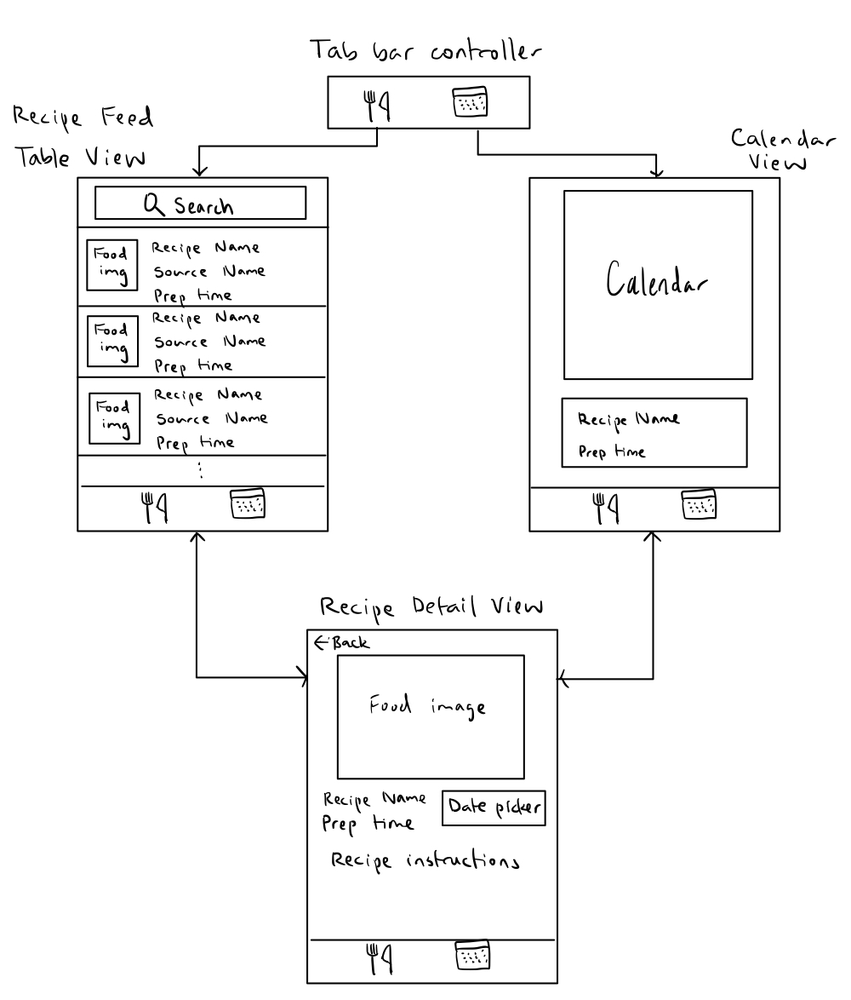

# EatsCalendar

## Table of Contents

1. [Overview](#Overview)
2. [Product Spec](#Product-Spec)
3. [Wireframes](#Wireframes)
4. [Schema](#Schema)

## Overview

### Description

EatsCalendar is an app designed to make deciding what to eat easier. The app allows users to view recipes taken from the Spoonacular API and schedule the ones they want to make on a calendar.

### App Evaluation

[Evaluation of your app across the following attributes]
- **Category:** Food
- **Mobile:** Being an app allows users to quickly pull up recipes that they are interested in. It also gives easy access to see what food plans they have made for the week.
- **Story:** The app makes it easy to decide on what to have for meals throughout the week.
- **Market:** Everyone who cooks or makes dishes.
- **Habit:** Those who cook can use this every day to either view recipe steps while they cook or plan meals for the future.
- **Scope:** The app shouldn't be too hard to complete before the end of the program. A stripped-down version of the app would still be interesting to build, though there may not be enough functionality for it to actually be useful to people. This app is well-defined.

## Product Spec

### 1. User Stories (Required and Optional)

**Required Must-have Stories**

1. On app startup, users can view a list of random recipes, showing information like the recipe name, cooking time, source name, and an image of the completed dish
2. Users can search for specific dishes using a search bar
3. Users can click on a recipe to view more details of the recipe, including a formatted view of the steps to make the recipe, a date picker for scheduling when to make the recipe, and a link to the original recipe webpage
4. Users can interact with the date picker to schedule when to make the recipe
5. Users can view their scheduled recipes on the calendar and click them to see the recipe's details
6. Users can delete scheduled recipes on the calendar

**Optional Nice-to-have Stories**

* Users can view a list of ingredients for their scheduled recipes for the week
* Users can check off ingredients that they have or have bought in this list
* Users can add/remove items in this list as necessary

### 2. Screen Archetypes

- [ ] Screen 1: Table View
* User stories 1 and 2
- [ ] Screen 2: Detail View
* User stories 3 and 4
- [ ] Screen 3: Calendar View
* User stories 5 and 6

### 3. Navigation

**Tab Navigation** (Tab to Screen)

* Recipe Feed
* Calendar

**Flow Navigation** (Screen to Screen)

- [ ] Recipe feed (home)
* => Refreshed home after search
* => Detail view
- [ ] Calendar
* => Detail view

## Wireframes

[Add picture of your hand sketched wireframes in this section]

### [BONUS] Digital Wireframes & Mockups

### [BONUS] Interactive Prototype

## Schema 

[This section will be completed in Unit 9]

### Models

1. Recipe
    - ID
    - Title
    - Source name
    - Prep time
    - Source URL
    - Image URL
    - Instructions
2. RecipeFeed
    - Results \[Recipe\]
3. Meal
    - ID
    - Date
    - Recipe

### Networking
Using Spoonacular API
- [ ] Recipe Feed
- GET random recipes (https://api.spoonacular.com/recipes/complexSearch)
- GET Search for recipes (https://api.spoonacular.com/recipes/complexSearch)

### Progress GIFs
Unit 8:

    
  
